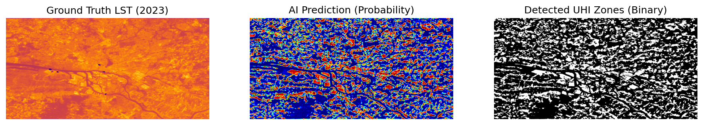
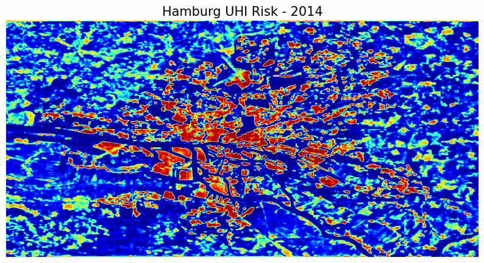

# Urban Heat Island Detection and Analysis - Hamburg Case Study

> **High-Resolution Micro-Climate Simulation via Deep Learning and Multi-Modal Data Fusion.**


*(AI-Driven Thermal Sharpening: Transforming coarse satellite data into precise building-level risk maps)*


*(Time-Lapse: 10-year evolution of Urban Heat Island risk in Hamburg, predicted by U-Net)*

## Project Overview

This project focuses on the detection and analysis of Urban Heat Islands (UHIs) in Hamburg, Germany. UHIs represent a critical environmental challenge where metropolitan areas experience significantly higher temperatures than surrounding rural regions.

The core objective of this study is to map heat risk zones at a high spatial resolution (10 meters). Traditional thermal satellite data (like Landsat) offers only 30m resolution, which is often too coarse for urban planning. This project overcomes that limitation by fusing thermal data with high-resolution optical imagery (Sentinel-2) and structural vector data (OpenStreetMap) using a U-Net deep learning model.

## Key Objectives

* **High-Resolution Mapping:** Downscaling thermal analysis from 30m to 10m to identify heat risks at the building block level.
* **Data Fusion:** Creating a multi-channel input tensor that combines Land Surface Temperature (LST) with environmental indices (NDVI, NDBI) and static urban morphology (Buildings, Roads, Water).
* **Temporal Analysis:** Analyzing the evolution of heat patterns in Hamburg over a decade (2014-2024) during peak summer months.
* **Semantic Segmentation:** Training a custom U-Net model to automatically classify "High Risk" zones based on spectral and structural signatures.

## Methodology

The pipeline follows a strict data engineering and machine learning workflow:

1.  **Data Acquisition:**
    * **Satellite:** Landsat-8/9 (LST) and Sentinel-2 (Optical) imagery fetched via Google Earth Engine API.
    * **Vector:** Building, road, and water footprints extracted using OpenStreetMap (OSM).

2.  **Preprocessing & Alignment:**
    * All data sources are reprojected and aligned to a common 10m pixel grid.
    * Calculation of spectral indices: NDVI (Vegetation) and NDBI (Built-up).
    * Rasterization of OSM vector data to create binary static masks.

3.  **Model Architecture:**
    * **Framework:** PyTorch.
    * **Network:** Custom U-Net with a 6-channel input layer (LST, NDVI, NDBI, Buildings, Roads, Water).
    * **Loss Function:** A combined Weighted Binary Cross Entropy + Dice Loss to handle class imbalance.
    * **Optimization:** Adam optimizer with dynamic learning rate adjustment.

4.  **Training:**
    * The model was trained on a local environment using Apple Metal Performance Shaders (MPS) acceleration.
    * Dataset splitting: 2014-2021 (Training), 2022-2024 (Validation/Testing).

## Project Structure

```text
URBAN-HEAT-ISLAND/
├── data/
│   ├── raw/            # Original Satellite imagery and OSM Vectors
│   ├── processed/      # 6-Channel NumPy Tensors (.npy) prepared for training
│   └── predictions/    # Model inference outputs (Risk Maps and raw probabilities)
├── models/             # Saved model weights (.pth files)
├── notebooks/          # Jupyter notebooks for initial EDA and final presentation
├── src/                # Core source code
│   ├── dataset.py      # Custom PyTorch Dataset class and DataLoaders
│   ├── model.py        # U-Net architecture definition
│   ├── train.py        # Training loop, validation, and checkpointing
│   ├── predict.py      # Inference script for generating full-map predictions
│   └── evaluate.py     # Metrics calculation (IoU, F1, Precision, Recall)
└── maps/               # High-quality visualization outputs and timelines
```

## Results

Initial training on the dataset yielded the following metrics on the validation set (2022-2024):

* **IoU (Intersection over Union):** ~0.50
* **Recall:** ~0.70
* **Visual Analysis:** The model successfully performs "thermal sharpening," identifying specific building clusters and industrial zones as heat sources, even when the raw thermal satellite data is coarse or partially noisy.

## Technology Stack

* **Language:** Python 3.x
* **Deep Learning:** PyTorch
* **Geospatial:** Rasterio, Geemap, OSMnx, Geopandas
* **Data Processing:** NumPy, OpenCV
* **Visualization:** Matplotlib, Folium

## Future Work

* **Simulation Tool:** Developing a web-based interface where urban planners can modify land cover (e.g., adding a park) and see the predicted impact on local temperature.
* **Tree Cover Integration:** Incorporating Copernicus Tree Cover Density data to distinguish between grass and canopy coverage for better cooling estimation.
* **Forecasting:** Extending the analysis to predict UHI distribution for 2030 based on current urbanization trends.

## License & Author

Author: Ozan Tuncbilek

Licensed under the MIT License. Open for research and collaboration.